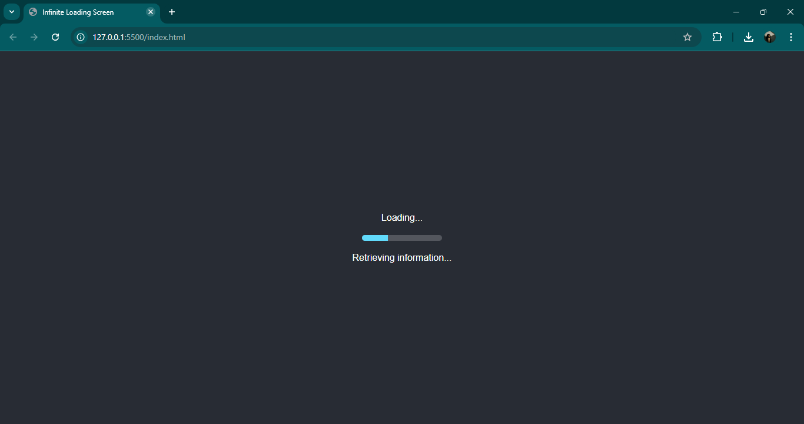
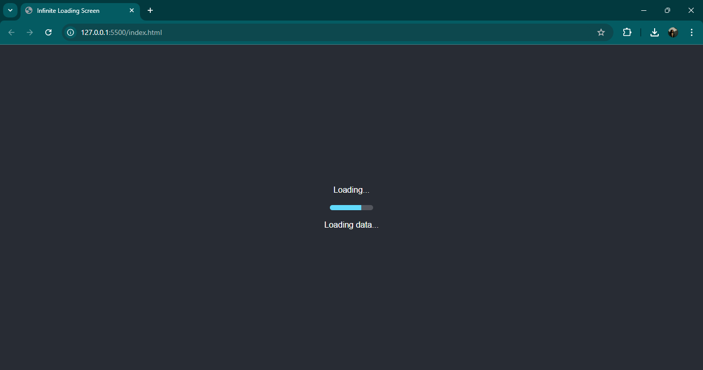
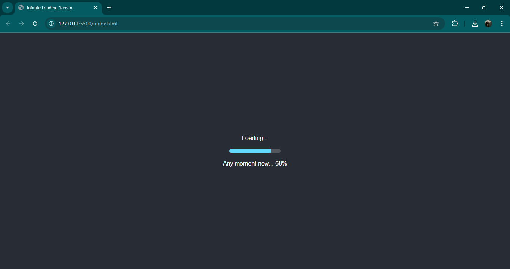

# Infinite Loading Screen Website 🎯
https://parv-nair.github.io/infinite-loading-screen/

## Basic Details
**Team Name:** NovaX  
**Team Members:**  
**Team Lead:** Parvathy V Nair - SJCET, Palai  
**Member 2:** Amrutha KA - SJCET, Palai  

## Project Description
A satirical website that features an endless loading screen animation, simulating the frustration of waiting indefinitely for a page to load. It's the pinnacle of internet futility!

## The Problem (that doesn't exist)
Ever felt the sheer thrill of watching a loading screen spin indefinitely? Well, we’re tackling the “problem” of webpages that load too quickly! People are losing out on the suspense and excitement of wondering, “Will this ever finish?”

## The Solution (that nobody asked for)
Our solution? A website that loads... forever! With spinning animations and “loading” text that never progresses, we aim to bring back the glory days of slow internet with a modern twist. The perfect tool for those who love waiting without reason.

## Technical Details

### Technologies/Components Used

#### For Software:
- **Languages used:** HTML, CSS, JavaScript
- **Frameworks used:** None (Pure front-end)
- **Libraries used:** None
- **Tools used:** Visual Studio Code, GitHub

#### For Hardware:
- None required for this “virtual” experience.

## Implementation

### For Software:

#### Installation
To clone and set up the project:

git clone infinite-loading-screen
cd infinite-loading-screen

## Screenshots 
!
*Initial loading animation on website open.*

!
*Loading screen after 10 seconds of loading suspense.*

!
*Hover effect on the loading icon for added frustration*

### Project Demo
# Video
[https://drive.google.com/drive/folders/1-GmQ1ktLwVVMGVMk1Q1JUZW86HjvdLVn](Video LINK!)
[https://drive.google.com/drive/folders/1-GmQ1ktLwVVMGVMk1Q1JUZW86HjvdLVn]

## Team Contributions
- Parvathy V Nair: Project concept, website design, animation creation, debugging
- Amrutha KA:Front-end recommendations

---
Made with ❤️ at TinkerHub Useless Projects 

